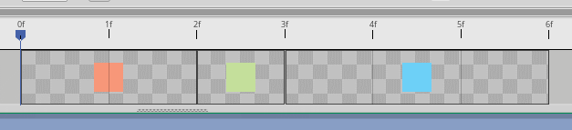

# sprite_get_data

This script allows you to grab time information (frame durations and start/end time offsets) from sprites in GameMaker Studio 2.3+. These things:



## How it works

During development, you call `sprite_get_frame_data_init` with your project path, like so:
```js
sprite_get_frame_data_init("sprite-times.json", "C:/git/game/game.yyp");
```
this will collect frame time information from every sprite in the project and create/update an included file in the project.

For the final release, you call `sprite_get_frame_data_init` with one argument, like so:
```js
sprite_get_frame_data_init("sprite-times.json");
```
this will load frame time information from the earlier saved JSON file.

## Functions

### sprite_get_frame_data_init(json_path[, yyp_path])

Should be called on game start to load frame time information.

### sprite_get_frame_data(sprite)

Returns an array of `{ from: time, to: time, len: time }` structs representing time information for every frame of a sprite.

### sprite_get_duration(sprite)

Returns total duration of a sprite's animation.

### sprite_get_frame_duration(sprite, subimg)

Returns duration of the given frame in a sprite.

### sprite_get_frame_start(sprite, subimg)

Returns starting time offset for the given frame in a sprite.

### sprite_get_frame_end(sprite, subimg)

Returns ending time offset for the given frame in a sprite.

### sprite_get_frame_index(sprite, time)

Finds the image index from a given time point - so, in the example above,
0.5 would return frame 0,
2.5 would return frame 1,
and 3.5 would return frame 2.